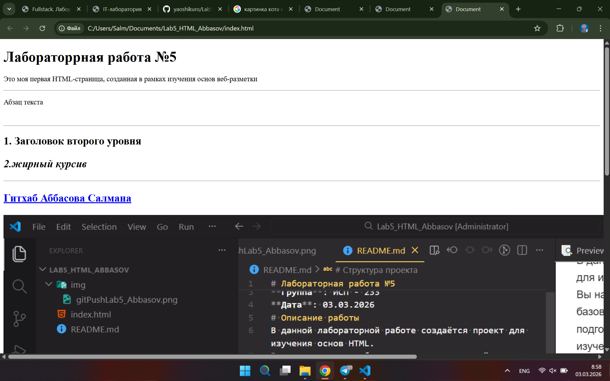

# Лабораторная работа №5
**ФИО**: Аббасов С.С.
**Группа**: ИСП - 233
**Дата**: 03.03.2026
# Описание работы
В данной лабораторной работе создаётся проект для изучения основ HTML.
Вы настраиваете рабочую директорию, создаёте базовые файлы, подключаете Git и GitHub, а также
подготавливаете HTML-файл для последующего изучения структуры веб-страницы.
# Структура проекта
- **index.html** - основной HTML файл
- [README.md](/README.md)
- **img/** - скриншоты

# Теги в HTML
структура парного тега
**<тег>тело<тег>**
*Пример*
```html
<h1>Это заголовок</h1>
```

---
Базовые HTML-теги
Примеры:
<h2>Заголовок</h2>
<p>Абзац текста</p>
<strong>Жирный</strong>
<em>Курсив</em>
<hr>
<a href="https://google.com">Google</a>


